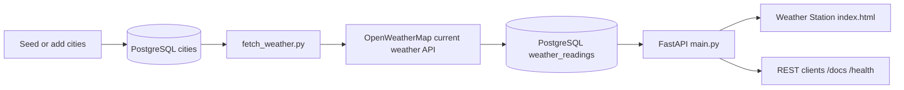

# Weather Pipeline

> An end-to-end weather data pipeline that ingests live OpenWeatherMap conditions into PostgreSQL and exposes stored readings through a FastAPI service and browser dashboard.

## Value proposition

Weather Pipeline demonstrates a complete data application rather than a one-off API call: ingestion is separated from serving, locations are modeled relationally, successful observations are retained as history, and clients can query the latest reading alongside recent stored observations. The repository includes a dashboard, seed data, health checks, and interactive FastAPI documentation.

## Overview

The project has two cooperating processes:

1. `fetch_weather.py` reads tracked cities from PostgreSQL, calls the OpenWeatherMap current-weather endpoint using latitude/longitude, and inserts a reading for each successful city.
2. `main.py` serves `index.html` and a FastAPI API that reads cities and weather history from PostgreSQL.

The database separates `cities` from append-only `weather_readings`. A city is unique by `(name, country)`; each reading stores temperature, feels-like temperature, humidity, textual condition, wind speed, and capture time. `seed.sql` provides 29 initial cities across Asia-Pacific, Europe, Africa, the Americas, and the Middle East.

## Workflow



## Features

- **Live ingestion:** fetches metric-unit current conditions for every tracked city and inserts one reading per successful response.
- **Historical storage:** appends observations to PostgreSQL rather than overwriting the latest value.
- **FastAPI service:** uses Pydantic response models, SQLAlchemy sessions, local CORS configuration, and automatic Swagger UI at `/docs`.
- **Browser dashboard:** displays city cards, latest readings, selectable recent history, and refreshes city cards every 60 seconds.
- **Operational endpoints:** `/health` checks database connectivity and returns `503` when PostgreSQL is unavailable; `/stats` reports city and reading totals.
- **Extensible tracking:** lists tracked locations and accepts new cities with name, country, latitude, and longitude.

## Tech stack

| Area | Implementation |
| --- | --- |
| Language | Python |
| Web API | FastAPI, Uvicorn |
| Validation | Pydantic |
| Persistence | PostgreSQL, SQLAlchemy, `psycopg2-binary` |
| External data source | OpenWeatherMap Current Weather API (`/data/2.5/weather`) |
| HTTP/configuration | Requests, `python-dotenv` |
| Frontend | Static HTML/CSS/JavaScript served by FastAPI |

## Repository layout

```text
.
├── api/
│   ├── database.py       # SQLAlchemy engine and session dependency
│   ├── models.py         # City and WeatherReading ORM models
│   └── schemas.py        # API request and response models
├── main.py               # FastAPI routes and dashboard delivery
├── index.html            # Weather Station browser dashboard
├── fetch_weather.py      # OpenWeatherMap ingestion job
├── schema.sql            # PostgreSQL schema bootstrap
├── seed.sql              # Initial tracked cities
├── requirements.txt      # Python dependencies
└── .env.example          # Environment-variable template
```

## Setup

### Prerequisites

- Python 3.11 or later
- PostgreSQL 18 (or a compatible PostgreSQL version)
- An [OpenWeatherMap API key](https://openweathermap.org/api)

The commands below use PowerShell on Windows.

### 1. Install dependencies

```powershell
python -m venv .venv
.\.venv\Scripts\Activate.ps1
python -m pip install --upgrade pip
python -m pip install -r requirements.txt
```

### 2. Create and initialize PostgreSQL

Create `weather_db`, then apply the checked-in schema and seed files:

```powershell
createdb -U postgres weather_db
psql -U postgres -d weather_db -f schema.sql
psql -U postgres -d weather_db -f seed.sql
```

`schema.sql` enables `pgcrypto` for UUID defaults and creates `cities` and `weather_readings`. `seed.sql` uses `ON CONFLICT (name, country) DO NOTHING`, so rerunning it does not duplicate cities.

### 3. Configure environment variables

Copy `.env.example` to `.env` and replace the placeholders:

```powershell
Copy-Item .env.example .env
```

```env
DB_HOST=localhost
DB_PORT=5432
DB_NAME=weather_db
DB_USER=postgres
DB_PASSWORD=your_postgres_password
OPENWEATHER_API_KEY=your_openweathermap_api_key
```

`.env` is ignored by Git because it contains credentials. The ingestion script also accepts legacy `OWN_API` as a fallback, but `OPENWEATHER_API_KEY` is the supported name. Never commit secrets.

## Usage

Start the API from the repository root:

```powershell
python -m uvicorn main:app --reload
```

Open the dashboard at <http://127.0.0.1:8000/> and interactive API documentation at <http://127.0.0.1:8000/docs>. Verify the database connection:

```powershell
Invoke-RestMethod http://127.0.0.1:8000/health
```

Expected response:

```json
{"status":"ok","database":"connected"}
```

In a second terminal with the virtual environment active, populate readings:

```powershell
python fetch_weather.py
```

The job reads all tracked cities, fetches current conditions, and inserts one reading per successful city. Run it repeatedly to build a historical dataset. For regular collection, schedule this command with Windows Task Scheduler, cron, or a workflow orchestrator; scheduling is not implemented inside this repository.

## API reference

| Method | Path | Behavior |
| --- | --- | --- |
| `GET` | `/` | Serves the Weather Station dashboard |
| `GET` | `/api` | Returns API status and version `1.0` |
| `GET` | `/health` | Checks PostgreSQL connectivity; returns `503` if unavailable |
| `GET` | `/cities` | Lists tracked cities ordered by name |
| `POST` | `/cities` | Adds a city; duplicate name/country pairs return `400` |
| `GET` | `/weather/{city}` | Returns the latest stored reading and recent stored readings |
| `GET` | `/stats` | Returns total city and reading counts |

Example query:

```powershell
Invoke-RestMethod "http://127.0.0.1:8000/weather/London?forecast_hours=24"
```

`forecast_hours` accepts values from 1 to 168. Despite the field name, the implementation returns stored readings from the preceding time window; it does **not** generate future forecasts. A city with no stored reading returns `404`.

Example city creation:

```powershell
Invoke-RestMethod http://127.0.0.1:8000/cities `
  -Method POST `
  -ContentType "application/json" `
  -Body '{"name":"Kuala Lumpur","country":"MY","lat":3.139,"lon":101.6869}'
```

## Data model

### `cities`

One row per tracked location, with name, country, latitude, and longitude. PostgreSQL enforces uniqueness for `(name, country)`.

### `weather_readings`

One row per ingestion event, linked to `cities` through `city_id`. It stores temperature, perceived temperature, humidity, condition, wind speed, and `recorded_at`. The append-only design preserves history for later analytics.

## Current status and honest limitations

The repository contains the FastAPI service, dashboard, PostgreSQL schema, seed data, and ingestion script needed for local deployment. PostgreSQL credentials and a valid OpenWeatherMap API key are required before live readings can be collected. The checked-in code does not include automated tests, migrations, Docker/Compose configuration, CI workflows, or an internal scheduler. No model training or predictive evaluation is present: this is an ingestion, storage, and serving pipeline, not an ML forecasting system.

## Future improvements

The existing roadmap identifies these next steps:

1. Add automated tests for routes, validation, and ingestion failures.
2. Add Alembic migrations instead of applying `schema.sql` manually.
3. Schedule ingestion with retry/backoff and structured logs.
4. Store timestamps as timezone-aware UTC values.
5. Add pagination and date-range filters for large reading histories.
6. Add a true forecast table/endpoint using OpenWeatherMap forecast data.
7. Containerize the API and PostgreSQL with Docker Compose.
8. Add CI checks for formatting, tests, and dependency security.

## Troubleshooting

If `/health` returns `503`, confirm PostgreSQL is running and that `DB_HOST`, `DB_PORT`, `DB_NAME`, `DB_USER`, and `DB_PASSWORD` match the local database. After changing `.env`, restart Uvicorn. If ingestion fails, confirm that `OPENWEATHER_API_KEY` is present and active; the script prints a failure for the affected city and continues with the remaining cities.
